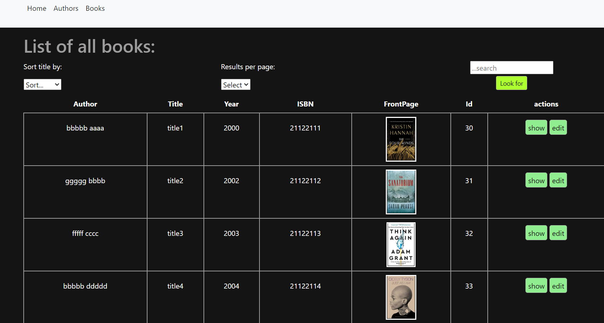

## LIBRARY ONE - SYMFONY 5 + MYSQL

## CURRENT VIEW:

## TO ARRANGE AFTER CLONING:

- env file: arrange DATABASE_URL="mysql://root:@127.0.0.1:3306/libraryone" record.
- go to: templates/includes/\_sort.html.twig and change values to 5/10/20/50/100 (I did not feed a db with larger amount of item. )
- arrange default value in BookController - in each of 3 functions that use limit.

## STEPS:

- create entities for books, authors + create relation (Many books to One Author).
- create migrations and migrate to the new database.
- create crud for authors and books.
- arrange Author Entity: \_\_toString method + create function to getFullName.
- add bootstrap and nav to get index og authors and books.
- add knp-paginator-bundle
- add sorting by title
- add select author
- add search for a title (improved - to verify)
- styling a little bit with bootstrap classess
- add scss
