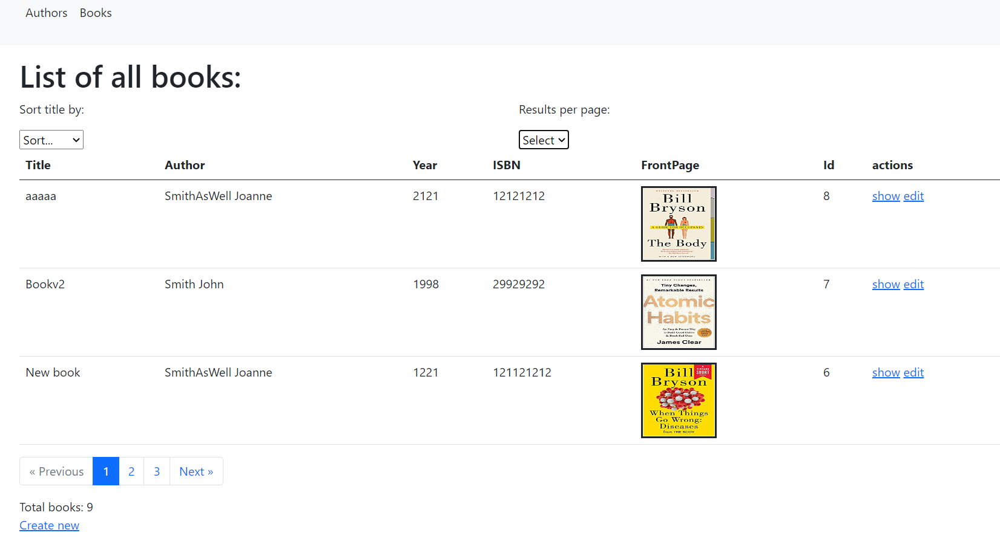

## LIBRARY ONE - SYMFONY 5 + MYSQL

## CURRENT VIEW:

## TO ARRANGE AFTER CLONING:

- env file: arrange DATABASE_URL="mysql://root:@127.0.0.1:3306/libraryone" record.

## STEPS:

- create entities for books, authors + create relation (Many books to One Author).
- create migrations and migrate to the new database.
- create crud for authors and books.
- arrange Author Entity: \_\_toString method + create function to getFullName.
- add bootstrap and nav to get index og authors and books.
- add knp-paginator-bundle
- add sorting by title
- add select author (not ready - passed in url only)
